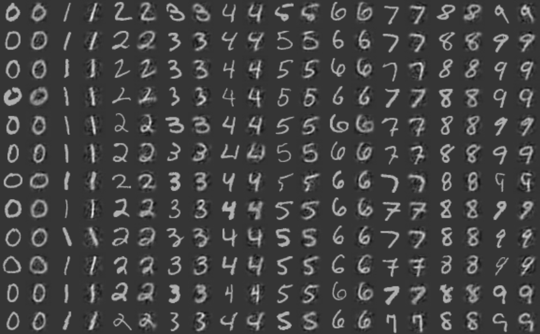

# Gaussian-Bipolar Restricted Boltzmann Machines
A NumPy implementation of contrastive divergence algorithm for training Gaussian-Bipolar Restricted Boltzmann Machines.
An autoencoder based on GBPRBM can be tested using MNIST example. 
Here is reconstruction of MNIST images using 500 hidden units:

Copyright (C) 2017 Altynbek Isabekov

GBPRBM_NumPy is free software: you can redistribute it and/or modify it under the terms of the GNU General Public License as published by the Free Software Foundation, either version 2 of the License, or (at your option) any later version.

GBPRBM_NumPy is distributed in the hope that it will be useful, but WITHOUT ANY WARRANTY; without even the implied warranty of MERCHANTABILITY or FITNESS FOR A PARTICULAR PURPOSE. See the GNU General Public License v2.0 for more details.
